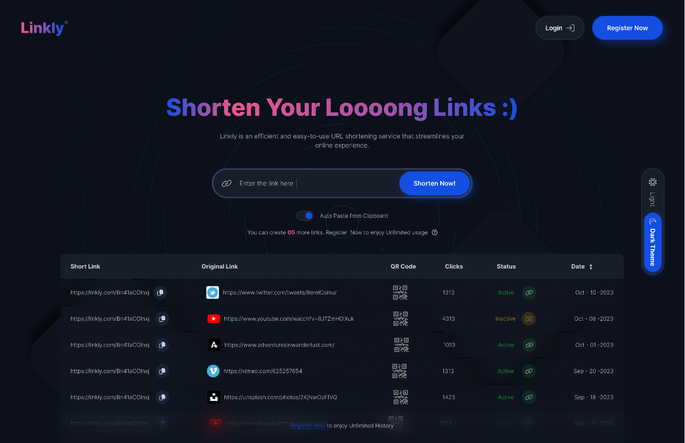

# URL Shortener



A simple and efficient URL shortener project built with [Node.js](https://nodejs.org/) and [Express](https://expressjs.com/).


## Features

-  **Shorten URLs:** Easily create short URLs for long links.
-  **Statistics:** Track the usage and analytics of your short URLs.
-  **User Authentication:** Secure your URL management with user accounts.

## Get Started

1.Clone the repository:

```bash
git clone https://github.com/Mohimkhan/url-shortener.git

```

## Configure the environment variables:

Create a .env file in the project root and add the following:

```bash
PORT=3000
DB_URL=your_mongodb_uri
SECRET_KEY=your_secret_key
```

Alternatively, copy the sample file:

   ```bash
   cp .env.sample .env
   ```

## Installation

2. Install the dependencies

   ```bash
    npm install 
    # or 
    yarn install
   ```

3. Start the server

   ```bash
   npm run start
   ```

The application will be accessible at http://localhost:3000

## Usage

1. Create a user account or log in.
<br>
2. Enter a long URL and click "Generate" to create a shortened link.
<br>
3. View comprehensive statistics to track URL usage.
5. For admin routes, change your role to 'ADMIN' in the database.

## Technical Highlights:

- **MVC Architecture:** Leverages a structured model-view-controller design for maintainability and scalability.
- **Node.js and Express:** Built on a robust and efficient JavaScript server-side runtime environment.
- **MongoDB Integration:** Seamlessly interacts with a MongoDB database for data storage and management.
- **Authentication and Authorization:** Implements secure user authentication and role-based access control.

## Learning Experience

As a newcomer to backend development, this project provided valuable learning experiences, including:

- **Backend Foundations:** Gained a solid understanding of backend development concepts, including routes, the MVC pattern, authentication, and authorization.
- **Role-Based Authentication:** Successfully implemented role-based access control to manage user permissions effectively.
- **Database Integration:** Mastered connecting to a MongoDB database for data storage and management.
- **Login and Signup Implementation:** Developed robust user account functionality for secure access and interaction with the application.

Initially, I was unfamiliar with role-based authentication, so I had to learn about it and implement it. Connecting to the database was challenging for me, as I am relatively new to backend development. However, I now have a better understanding of how login and signup processes work. Although I didn't replicate the design fully, the main focus was on learning backend development, so there might be responsive issues. Overall, it was a great experience for me.
